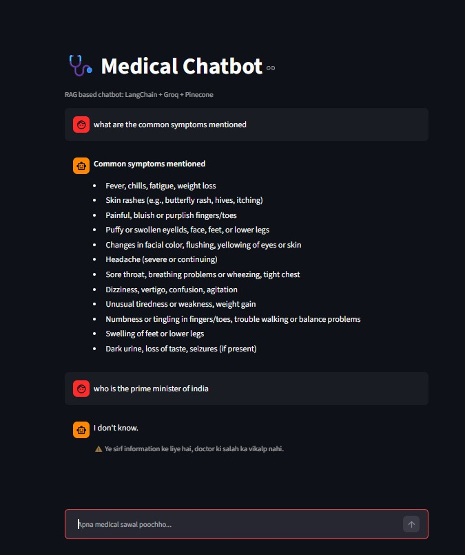

# Medical Chatbot (RAG)

A Retrieval-Augmented Generation (RAG) chatbot that answers medical questions using only the content of a PDF document. If the answer is not in the PDF, it replies "I don't know".

Built for the UDHBHAV GenAI Workshop by KRIVA ML Society (KML).

## Screenshot

## How It Works

1. `ingest.py` loads `medical.pdf`, splits it into chunks (800 characters, 100 overlap), creates embeddings and stores them in a Pinecone index.
2. `app.py` takes a user question, retrieves the 4 most relevant chunks from Pinecone, and sends them to the Groq LLM, which answers only from that context.

## Tech Stack

- Python 3.12
- LangChain
- Pinecone (vector database)
- HuggingFace Embeddings (all-MiniLM-L6-v2)
- Groq LLM (openai/gpt-oss-20b)
- Streamlit (frontend)

## Setup

1. Clone the repo:
   git clone https://github.com/kumaranupsingh75-svg/Anup-Singh.git
   cd Anup-Singh

2. Create a virtual environment and install packages:
   python -m venv .venv
   .venv\Scripts\activate
   pip install -r requirements.txt

3. Create a `.env` file in the project folder:
   GROQ_API_KEY=your_groq_key
   PINECONE_API_KEY=your_pinecone_key

4. Store the PDF data in Pinecone (run once):
   python ingest.py

5. Start the app:
   streamlit run app.py

## Project Files

- `app.py` : Streamlit chat app
- `ingest.py` : PDF to Pinecone pipeline
- `medical.pdf` : knowledge source
- `requirements.txt` : dependencies

## Note

This chatbot is for learning purposes only and is not a substitute for professional medical advice.

## Author

Anup Kumar Singh, B.Tech IT, KIET Group of Institutions, Ghaziabad
